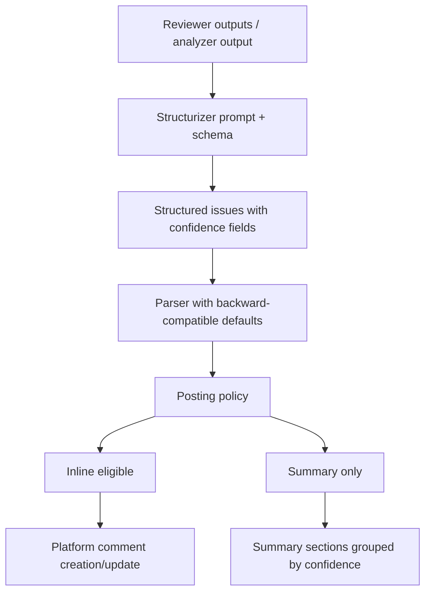
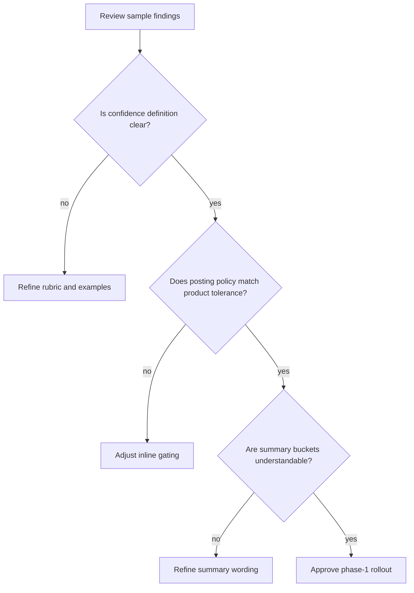
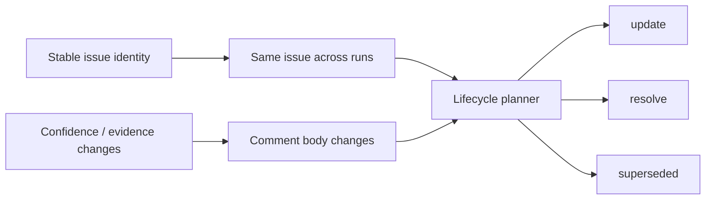

# Hydra Issue Evidence and Confidence Plan

## 1. Summary

Hydra's structured issues currently capture only:

- `severity`
- `file`
- `line`
- `title`
- `description`
- `suggestedFix`

This is not enough for downstream posting decisions. The platform layer cannot distinguish:

- a high-confidence defect directly supported by the diff
- a plausible risk that still needs runtime or environment verification
- a weak hypothesis that should be kept in the summary but not posted inline

This plan adds an explicit "evidence strength" layer to structured issues and uses it to gate inline comments.

The immediate product goal is:

- high-confidence findings can be posted inline
- low-confidence findings stay in the summary
- review output becomes more trustworthy without reducing recall too aggressively

This document is written for human review and implementation planning.

## 2. Problem Statement

Current behavior over-indexes on `severity` and under-models certainty.

That creates three product problems:

1. Inline comments can feel overconfident even when the model is speculating.
2. Users cannot tell whether a finding is directly proven by code or inferred from incomplete context.
3. The later comment lifecycle design (`update / resolve / superseded`) has no stable way to express "same issue, but confidence changed".

## 3. Goals

### Product goals

- Reduce noisy inline comments without hiding potentially useful findings.
- Make confidence and evidence explicit to the user.
- Allow posting policy to make deterministic decisions from structured data.

### Engineering goals

- Extend the issue schema without breaking older runs.
- Keep the first rollout mostly inside structurization, summary rendering, and posting policy.
- Preserve compatibility with future comment lifecycle work.

## 4. Non-Goals

- No numeric scoring model in phase 1.
- No semantic proof engine or automatic formal verification.
- No attempt to fully validate model evidence against AST/control flow in phase 1.
- No platform-native workflow changes yet beyond inline gating and richer summary output.

## 5. Proposed Data Model

Add the following fields to structured issues in [types.go](/home/guwanhua/Desktop/git/hydra/internal/orchestrator/types.go#L131):

```go
Confidence           string // high | medium | low
EvidenceLines        []int
EvidenceSummary      string
Repro                string
RequiresVerification bool
```

### Field intent

- `Confidence`
  A discrete confidence class used by posting policy and summary grouping.
- `EvidenceLines`
  The most relevant lines supporting the claim. Prefer changed lines or nearby context.
- `EvidenceSummary`
  One short explanation of why the evidence supports the issue.
- `Repro`
  Minimal trigger condition or reproduction hint. Empty if not known.
- `RequiresVerification`
  Indicates the issue depends on runtime behavior, configuration, integration state, timing, or assumptions that are not fully visible in the diff.

## 6. Confidence Semantics

Use fixed semantics so both prompt writers and reviewers evaluate findings consistently.

### `high`

Use when:

- the bug mechanism is directly visible in the diff or adjacent context
- the evidence chain is short and concrete
- the claim does not depend on speculative external behavior

Example:

- nil dereference after removing a guard
- wrong branch condition that clearly inverts behavior
- SQL built by direct string concatenation from user input

### `medium`

Use when:

- the issue is likely real, but some missing context still matters
- the code smell strongly suggests a bug, but the final outcome depends on calling patterns or configuration

Example:

- timeout or retry logic probably broken, but calling pattern is not fully shown
- permission check appears incomplete, but route/middleware composition is only partially visible

### `low`

Use when:

- the issue is speculative
- the evidence is weak or indirect
- the model is extrapolating beyond what the diff actually proves

Example:

- "this may cause performance problems" without concrete hot-path evidence
- "this might race" without a visible shared-state path

### `RequiresVerification = true`

Set to true when confirmation requires:

- runtime execution
- integration environment
- external service behavior
- concurrency timing
- non-visible configuration or deployment state

`RequiresVerification` is orthogonal to confidence. A finding can be `medium` and also require verification.

## 7. End-to-End Flow



## 8. Posting Policy

The key product rule is: inline comments should require both severity and evidential quality.

### Recommended phase-1 policy

| Severity | Confidence | RequiresVerification | Post inline |
| --- | --- | --- | --- |
| high | high | false | yes |
| high | medium | false | yes |
| high | low | any | no |
| medium | high | false | yes |
| medium | medium | false | no |
| low | any | any | no |
| any | any | true | no |

This policy is intentionally conservative.

Reasoning:

- false-positive inline comments are the highest UX cost
- summary-only findings are still visible, so recall is preserved
- phase 1 should improve trust before it optimizes recall

### Recommended implementation hook

Introduce a single decision function in the posting layer:

```go
func ShouldPostInline(issue ParsedIssue) bool
```

That keeps policy centralized and easy to tune after rollout.

## 9. Summary Output Changes

Summary output should become explicitly confidence-aware.

Recommended sections:

- `High-confidence findings`
- `Needs verification`
- `Lower-confidence findings not posted inline`

Each summary item should include:

- severity
- confidence
- evidence lines when available
- a short note if verification is required

Example rendering:

```md
- High | High confidence | app/auth.go:42,57
  Missing authorization gate on admin action.

- Medium | Medium confidence | requires verification
  Retry loop may not preserve cancellation semantics when the upstream client returns wrapped context errors.
```

## 10. Human Review Flow

This is the flow reviewers should use when assessing the design, prompts, and rollout.



### Review checklist

- Do the three confidence levels feel semantically distinct?
- Would two engineers classify the same issue similarly?
- Does `RequiresVerification` capture the right class of uncertain findings?
- Is the inline gating policy conservative enough for first rollout?
- Are `EvidenceLines` realistic for the current structurizer quality?
- Does the summary present low-confidence findings without overstating them?
- Are there issue classes where the proposed fields are still insufficient?

## 11. Schema and Prompt Changes

Three components need to change together:

1. structured issue JSON schema
2. structurizer prompt
3. structurizer system prompt

### Prompt requirements

The prompt must explicitly instruct the model to:

- classify `confidence` using the fixed rubric
- include `evidenceLines` only when grounded in the visible diff/context
- write `EvidenceSummary` as a concise evidence chain
- leave `Repro` empty if it would otherwise be invented
- set `RequiresVerification` to true when runtime or hidden context is needed

### Parser behavior

Parser should remain backward-compatible:

- missing `confidence` -> `medium`
- missing `evidenceLines` -> `[]`
- missing `EvidenceSummary` -> `""`
- missing `Repro` -> `""`
- missing `RequiresVerification` -> `false`

Invalid confidence values should be normalized to `medium`.

## 12. Relationship to Comment Lifecycle

This design is intentionally compatible with the future inline comment lifecycle plan in [COMMENT_LIFECYCLE_PLAN.md](/home/guwanhua/Desktop/git/hydra/COMMENT_LIFECYCLE_PLAN.md#L1).

Key rule:

- `confidence`, `evidenceLines`, `EvidenceSummary`, `Repro`, and `RequiresVerification` should affect comment body
- they should not be part of the stable issue identity key

Reason:

- these fields may improve across debate rounds
- a confidence upgrade should be treated as an `update`, not a new issue

Interaction model:



## 13. Rollout Plan

### Phase 1

- extend types
- extend schema
- update structurizer prompts
- parse and default new fields
- group summary output by confidence
- gate inline comments using `ShouldPostInline`

### Phase 2

- add telemetry on how many findings fall into each bucket
- review false-positive rate before relaxing policy
- connect confidence-aware bodies to lifecycle `update / resolve / superseded`

### Phase 3

- optionally refine rubric by issue category
- optionally add richer evidence objects later if needed

## 14. Risks and Mitigations

### Risk: model overuses `high`

Mitigation:

- stricter rubric language
- sample-based prompt iteration
- conservative inline gating

### Risk: evidence lines are noisy or empty

Mitigation:

- allow empty `EvidenceLines`
- do not block issue creation on missing lines
- use lines only as supporting metadata in phase 1

### Risk: summary becomes too verbose

Mitigation:

- keep `EvidenceSummary` to one short sentence
- show low-confidence findings in a separate, compressed section

### Risk: rollout hides too many real issues

Mitigation:

- do not drop low-confidence issues entirely
- keep them in summary
- evaluate summary-only findings during rollout review

## 15. Metrics to Watch

Recommended rollout metrics:

- number of inline comments per review
- percentage of findings by confidence bucket
- percentage of findings requiring verification
- reviewer acceptance / dismissal rate for inline comments
- proportion of summary-only findings later confirmed by humans

## 16. Acceptance Criteria

The design should be considered ready for implementation when reviewers agree that:

- confidence definitions are clear enough for consistent use
- phase-1 posting policy is acceptable
- the added fields are sufficient for downstream gating
- backward compatibility behavior is acceptable
- the interaction with comment lifecycle is coherent

The implementation should be considered complete when:

- structured issue schema supports the new fields
- parser defaults are in place
- summary rendering groups findings by confidence
- inline posting uses the new policy
- tests cover parsing, policy decisions, and summary grouping

## 17. Open Questions for Review

- Should `medium + high severity + no verification` post inline in phase 1, or should phase 1 allow only `high + high`?
- Do we want `EvidenceSummary` in phase 1, or is `EvidenceLines` enough?
- Should low-confidence findings appear in the same summary block or a collapsed section?
- Do we need category-specific confidence guidance for security vs correctness vs performance findings?

